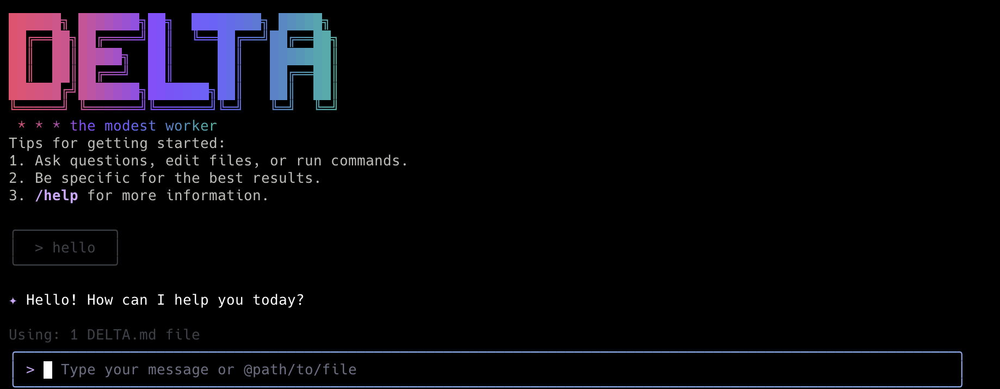

# Delta Code



AI-powered CLI for developers, adapted from Gemini CLI and optimized for Delta3‑Coder models.

## Install

Requires Node.js ≥ 20.

```bash
# Clone and enter the repo (your fork)
git clone https://github.com/tjdoomer/Delta-code.git
cd Delta-code

# Build
npm ci
npm run build

# Install the CLI globally
npm install -g .
delta
```

## Quick start

```bash
delta
```

## Authentication

You can authenticate in two ways:

- Interactive (recommended): run `delta`, pick a provider from the menu, and follow the prompts. If a required key is missing, the CLI will ask for it and store it in the current process environment.
- Environment variables: define the variables below (e.g., in a `.env` file) and run `delta`. The CLI will detect them and skip the prompts.

### OpenAI

- Best path: choose “OpenAI” in the menu and paste your API key (and optionally a custom base URL/model).
- Environment variables:

```bash
OPENAI_API_KEY="sk-..."
# Optional if using a custom endpoint
OPENAI_BASE_URL="https://api.openai.com/v1"
# Optional; set a default model name for your workflow
OPENAI_MODEL="gpt-4o-mini"
```

### Google (Gemini API key)

- Best path: choose “Google (Gemini API key)” and paste your Google AI Studio key.
- Environment variables:

```bash
GEMINI_API_KEY="your-google-ai-studio-key"
```

### Azure OpenAI

- Best path: choose “Azure OpenAI” and paste:
  - API Key
  - Full base URL to your deployment’s chat completions endpoint
  - Deployment name (used as the model id)
- Environment variables (what the CLI sets under the hood):

```bash
OPENAI_API_KEY="your-azure-openai-key"
OPENAI_BASE_URL="https://{resource}.openai.azure.com/openai/deployments/{deployment}/chat/completions?api-version=2024-08-01-preview"
OPENAI_MODEL="{deployment}"
```

### AWS Bedrock (Claude)

- Best path: choose “AWS Bedrock (Claude)” and enter:
  - Access Key ID (as the API Key field)
  - Secret Access Key (as the Base URL field)
  - Region (as the Model field)
- Environment variables:

```bash
AWS_ACCESS_KEY_ID="AKIA..."
AWS_SECRET_ACCESS_KEY="..."
AWS_REGION="us-east-1"
```

### Claude (Anthropic)

- Best path: choose “Claude” and paste your Anthropic API key.
- Environment variables:

```bash
ANTHROPIC_API_KEY="your-anthropic-key"
```

### Using a .env file

Place a `.env` file in your working directory and add the variables for the provider you use. Example with multiple providers configured (only the ones you use are required):

```bash
# OpenAI
OPENAI_API_KEY=sk-...
OPENAI_BASE_URL=https://api.openai.com/v1
OPENAI_MODEL=gpt-4o-mini

# Google Gemini
GEMINI_API_KEY=...

# Azure OpenAI
# OPENAI_API_KEY=...
# OPENAI_BASE_URL=https://{resource}.openai.azure.com/openai/deployments/{deployment}/chat/completions?api-version=2024-08-01-preview
# OPENAI_MODEL={deployment}

# AWS Bedrock
AWS_ACCESS_KEY_ID=...
AWS_SECRET_ACCESS_KEY=...
AWS_REGION=us-east-1

# Anthropic Claude
ANTHROPIC_API_KEY=...
```

## Docs

- Getting started and commands: ./docs/
- Authentication details: ./docs/cli/authentication.md
- Troubleshooting: ./docs/troubleshooting.md

## License & credits

See ./LICENSE. Based on Google’s Gemini CLI with adaptations for Delta‑Coder models.
